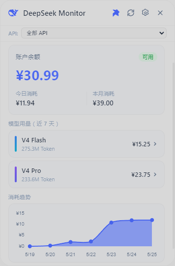
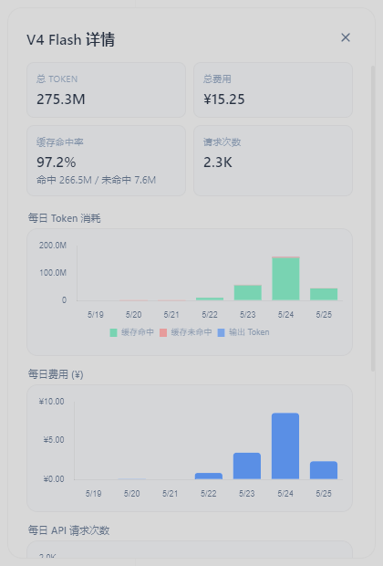

# DeepSeek Monitor for Windows

> 🖥️ Windows 系统托盘工具 — 实时监控 DeepSeek API 消耗与费用

复刻自 [JayHome137/DeepSeekMonitor](https://github.com/JayHome137/DeepSeekMonitor)（macOS 版），使用 Electron 重建为 Windows 原生体验。


## 功能

- **余额监控** — 实时显示 DeepSeek 账户余额（总余额 / 今日消耗 / 本月消耗）
- **Token 用量** — 按模型（V4 Flash / V4 Pro）和 API Key 展示 Token 消耗与费用
- **消耗趋势** — 7 天 Token / 费用柱状图或折线图，支持分 API Key 多色展示
- **缓存命中率** — 详情窗口展示每日缓存命中/未命中 Token、API 请求次数
- **用量导入** — 支持从 DeepSeek Usage 页面导出的 ZIP（含 amount CSV）手动或自动导入
- **自动导出** — 模拟浏览器自动登录 DeepSeek 平台并触发用量导出（实验性）
- **本地缓存** — 重启后立即显示上次数据，不白屏
- **浅色/深色主题** — 设置里一键切换
- **窗口透明度** — 可调节面板透明度

## 截图

### 主面板


### 模型详情


## 安装

### 从源码运行

```bash
git clone https://github.com/aidorulian/DeepSeekMonitor-Windows.git
cd DeepSeekMonitor-Windows
npm install
npm start
```

### 构建安装包

```bash
npm run build
# 输出在 dist/DeepSeek Monitor Setup x.x.x.exe
```

## 使用

1. 点击系统托盘 DeepSeek 图标 → 右键 **设置**
2. 输入 [DeepSeek API Key](https://platform.deepseek.com/api_keys) → 点击「验证并保存」
3. 配置**自动导入目录**（如 `D:\Downloads`）
4. 从 DeepSeek Usage 页面导出 amount 格式的 ZIP 放入该目录，自动导入
5. 面板显示余额 + Token 用量 + 趋势图

### 自动网页导出（实验性）

1. 设置 → 自动网页导出 → 勾选启用
2. 点击「打开登录页面」→ 在弹出的浏览器中登录 DeepSeek
3. 之后软件会按设定频率自动访问 usage 页面、点击导出、下载到导入目录

## CSV 格式说明

DeepSeek Usage 页面导出 ZIP 包含两个文件：

| 文件 | 内容 |
|---|---|
| `amount-*.csv` | **推荐** — Token 明细（按类型、API Key 分列） |
| `cost-*.csv` | 账单汇总（仅有费用，无 Token 明细） |

软件优先解析 amount CSV（含完整 Token + API Key 信息）。仅当没有 amount 时才会使用 cost CSV（显示为 "Unknown"）。

## 技术栈

- **Electron 33** — 桌面框架
- **Chart.js** — 趋势图表
- **electron-store** — 本地持久化

## 致谢

本项目是 [JayHome137/DeepSeekMonitor](https://github.com/JayHome137/DeepSeekMonitor) 的 Windows 移植版。原版为 macOS Swift/SwiftUI 应用，本项目用 Electron 重建，保留了原版的 UI 设计和核心功能逻辑（CSV 解析、用量聚合、自动导出 JS 注入等）。

## 许可证

MIT
